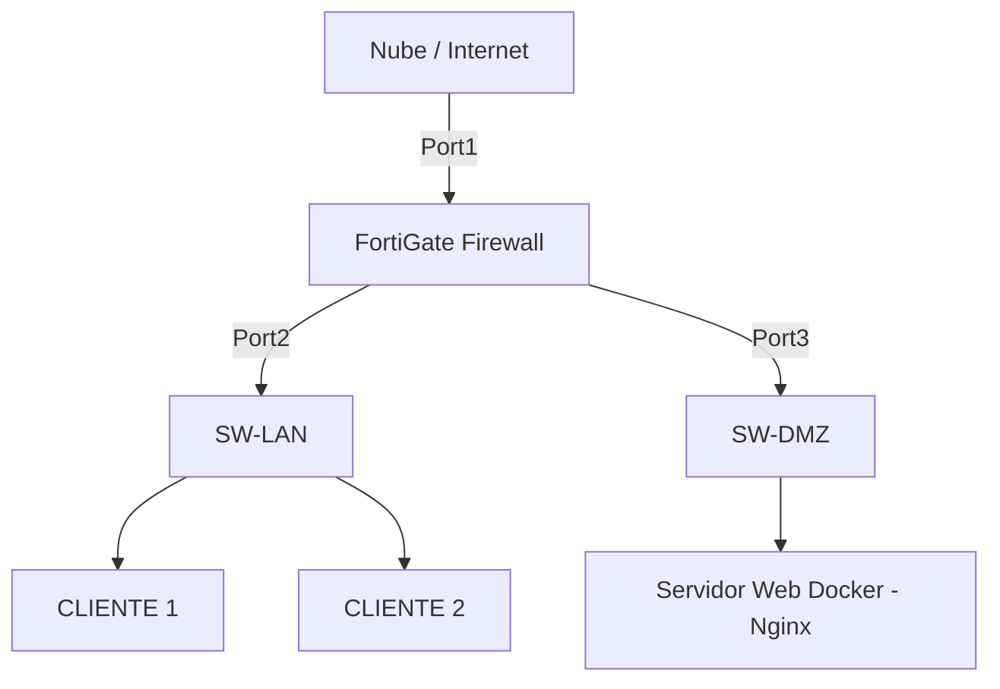

# 🛡️ Laboratorio de Seguridad Perimetral y Segmentación con FortiGate-VM

Proyecto de infraestructura y seguridad de redes diseñado desde cero utilizando **GNS3** para emular un entorno corporativo real y un firewall perimetral **FortiGate (FortiOS 7.0)**. El objetivo principal es mitigar fallas de diseño comunes (bucles de enrutamiento) mediante la implementación de un modelo estricto de tres zonas de seguridad independientes.

🌐 **Despliegue del Portafolio Web:** [https://github.io](https://github.io)

---

## 🗺️ Topología de la Red

La infraestructura está segmentada lógicamente en tres zonas con sus respectivas interfaces físicas en el FortiGate:

*   **Zona WAN (Port1):** Salida segura a Internet vía emulación Cloud (DHCP).
*   **Zona LAN (Port2):** Segmento interno protegido para clientes corporativos.
*   **Zona DMZ (Port3):** Zona desmilitarizada aislada para servidores públicos.



---

## 📊 Plan de Direccionamiento IP

| Interfaz / Zona | Red IP (Subred) | IP del FortiGate (Gateway) | Propósito |
| :--- | :--- | :--- | :--- |
| **Port1 (WAN)** | DHCP / Red Física | Automática | Acceso a Internet real |
| **Port2 (LAN)** | `192.168.10.0/24` | `192.168.10.1` | Clientes internos seguros |
| **Port3 (DMZ)** | `172.16.10.0/24` | `172.16.10.1` | Servidores Web aislados |

---

## 🛠️ Configuración Base (FortiOS CLI)

A continuación se detallan los comandos principales ejecutados en la consola del FortiGate para el aprovisionamiento de interfaces y políticas de seguridad:

### 1. Configuración de Interfaces lógicas
```text
config system interface
    edit port1
        set mode dhcp
        set allowaccess ping http https ssh
    next
    edit port2
        set mode static
        set ip 192.168.10.1 255.255.255.0
        set allowaccess ping http https
    next
    edit port3
        set mode static
        set ip 172.16.10.1 255.255.255.0
        set allowaccess ping http https
    next
end
```

### 2. Políticas de Firewall y Control de Acceso
```text
config firewall policy
    edit 1
        set name "LAN_a_DMZ"
        set srcintf "port2"
        set dstintf "port3"
        set srcaddr "all"
        set dstaddr "all"
        set action accept
        set schedule "always"
        set service "HTTP" "PING"
    next
    edit 2
        set name "LAN_a_Internet"
        set srcintf "port2"
        set dstintf "port1"
        set srcaddr "all"
        set dstaddr "all"
        set action accept
        set schedule "always"
        set service "ALL"
        set nat enable
    next
end
```

---

## 🧪 Pruebas de Verificación de Tráfico

Para validar el correcto funcionamiento de las políticas de seguridad y la traducción de direcciones (NAT), se realizaron las siguientes pruebas desde la consola del `CLIENTE1`:

1.  **Conectividad local ICMP:** `ping 172.16.10.10` exitoso hacia la DMZ.
2.  **Petición de servicios web:** `rlogin 172.16.10.10 80` con respuesta HTTP del contenedor Docker.
3.  **Salida a internet con NAT:** `ping 8.8.8.8` exitoso a través de la interfaz WAN.

---
🔧 **Tecnologías utilizadas:** Fortinet FortiOS, GNS3 Simulator, Docker Containers, Cisco L2/L3 Switching, Network Address Translation (NAT).
